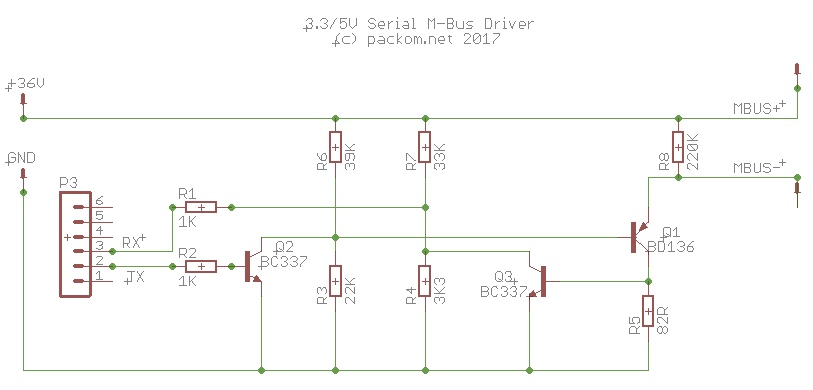

..
 OTB-IOT - Out of The Box Internet Of Things
 Copyright (C) 2017 Piers Finlayson

M-Bus Support
=============

otb-iot supports communication with devices that support the `M-Bus protocol <http://www.m-bus.com/info/mbuse.php>`_.  This is used by a variety of heat and other meters.  The standard (wired) M-Bus protocol is based on serial communications, but the two lines run at +36V and +24V respectively.  This allows the meter to be powered by the bus.

To communicate with M-Bus devices using otb-iot a simple circuit must be built to allow the 3.3 or 5V support by the otb-iot device (depending on what unit you're using) to be converted to the +36/24V used by M-Bus.

Once this circuit is place between the otb-iot module and the M-Bus capable meter, otb-iot's :doc:`Serial over MQTT<serial_over_mqtt>` function can be used to communicate with the M-Bus device.

Circuit
-------

This circuit is based on: https://github.com/rscada/libmbus/blob/master/hardware/MBus_USB.pdf

Communicating with Device
-------------------------

A sequence of MQTT commands such as the following should return M-Bus data from the device:

::

  topic: /otb-iot/chipid         message: set/config/serial/disable
  topic: /otb-iot/chipid         message: set/config/serial/tx/15
  topic: /otb-iot/chipid         message: set/config/serial/rx/13
  topic: /otb-iot/chipid         message: set/config/serial/speed/2400
  topic: /otb-iot/chipid         message: set/config/serial/enable
  topic: /otb-iot/chipid         message: trigger/serial/buffer/dump
  topic: /otb-iot/chipid         message: trigger/serial/send/105b015c16
  topic: /otb-iot/chipid         message: trigger/serial/buffer/dump

In the data string sent, change 01 to the meter's M-Bus address.

Data such as the following should be returned - although the exact contents will depend on your meter.  (This output is from an Itron CF Echo II.)

::

  topic: /otb-iot/5ccf7f0b583b/status message: ok:68/4d/4d/68/08/01/72/60/31/27/14/77/04/09/04/97/10/00/00/0c/78/60/31/27/14
  topic: /otb-iot/5ccf7f0b583b/status message: ok:04/07/cd/03/00/00/0c/15/80/63/01/00/3b/2d/99/99/99/0b/3b/00/00/00/0a/5a/53
  topic: /otb-iot/5ccf7f0b583b/status message: ok:01/0a/5e/21/02/3b/61/99/99/99/04/6d/24/13/2b/22/02/27/70/03/09/fd/0e/22/09
  topic: /otb-iot/5ccf7f0b583b/status message: ok:fd/0f/47/0f/04/00/ff/16/xx

Decoding
--------

rscada's M-Bus code can be used to decode this output.  A forked copy is available here: https://github.com/piersfinlayson/libmbus

In addition to libmbus and various utilities from rSCADA this fork also contains a utility to decode hex bytes returned my otb-iot.

To use:

::

  git clone https://github.com/piersfinlayson/libmbus
  cd libmbus
  ./build.sh
  bin/mbus_process_hex_dump <hex string>

(Alternatively, libmbus is a submodule within `otb-iot <https://github.com/piersfinlayson/otb-iot>`_ - just run make mbus_tools.  The binary will be in extras/mbus_tools/bin.)

For example, given the output above, the following command would be run:

::

  bin/mbus_process_hex_dump 684d4d680801725555555577040904551000000c78555555550407cd0300000c15806301003b2d9999990b3b0000000a5a20020a5e00033b61999999046d11153e210227640309fd0e2209fd0f470f04006016

This would return:

::

  <?xml version="1.0" encoding="ISO-8859-1"?>
  <MBusData>
      <SlaveInformation>
          <Id>55555555</Id>
          <Manufacturer>ACW</Manufacturer>
          <Version>9</Version>
          <ProductName>Itron CF Echo 2</ProductName>
          <Medium>Heat: Outlet</Medium>
          <AccessNumber>85</AccessNumber>
          <Status>10</Status>
          <Signature>0000</Signature>
      </SlaveInformation>
      <DataRecord id="0">
          <Function>Instantaneous value</Function>
          <StorageNumber>0</StorageNumber>
          <Unit>Fabrication number</Unit>
          <Value>55555555</Value>
      </DataRecord>
      <DataRecord id="1">
          <Function>Instantaneous value</Function>
          <StorageNumber>0</StorageNumber>
          <Unit>Energy (10 kWh)</Unit>
          <Value>973</Value>
      </DataRecord>
      <DataRecord id="2">
          <Function>Instantaneous value</Function>
          <StorageNumber>0</StorageNumber>
          <Unit>Volume (1e-1  m^3)</Unit>
          <Value>16380</Value>
      </DataRecord>
      <DataRecord id="3">
          <Function>Value during error state</Function>
          <StorageNumber>0</StorageNumber>
          <Unit>Power (100 W)</Unit>
          <Value>999999</Value>
      </DataRecord>
      <DataRecord id="4">
          <Function>Instantaneous value</Function>
          <StorageNumber>0</StorageNumber>
          <Unit>Volume flow (m m^3/h)</Unit>
          <Value>0</Value>
      </DataRecord>
      <DataRecord id="5">
          <Function>Instantaneous value</Function>
          <StorageNumber>0</StorageNumber>
          <Unit>Flow temperature (1e-1 deg C)</Unit>
          <Value>220</Value>
      </DataRecord>
      <DataRecord id="6">
          <Function>Instantaneous value</Function>
          <StorageNumber>0</StorageNumber>
          <Unit>Return temperature (1e-1 deg C)</Unit>
          <Value>300</Value>
      </DataRecord>
      <DataRecord id="7">
          <Function>Value during error state</Function>
          <StorageNumber>0</StorageNumber>
          <Unit>Temperature Difference (1e-2  deg C)</Unit>
          <Value>999999</Value>
      </DataRecord>
      <DataRecord id="8">
          <Function>Instantaneous value</Function>
          <StorageNumber>0</StorageNumber>
          <Unit>Time Point (time &amp; date)</Unit>
          <Value>2017-01-30T21:17:00</Value>
      </DataRecord>
      <DataRecord id="9">
          <Function>Instantaneous value</Function>
          <StorageNumber>0</StorageNumber>
          <Unit>Operating time (days)</Unit>
          <Value>868</Value>
      </DataRecord>
      <DataRecord id="10">
          <Function>Instantaneous value</Function>
          <StorageNumber>0</StorageNumber>
          <Unit>Firmware version</Unit>
          <Value>22</Value>
      </DataRecord>
      <DataRecord id="11">
          <Function>Instantaneous value</Function>
          <StorageNumber>0</StorageNumber>
          <Unit>Software version</Unit>
          <Value>47</Value>
      </DataRecord>
      <DataRecord id="12">
          <Function>Manufacturer specific</Function>
          <Value>04 00</Value>
      </DataRecord>
  </MBusData>

(Note SlaveInformation->Id and Fabrication number have been redacted.

Automated Reading 
-----------------

otb-iot contains a `script`_ to automatically query an otb-iot device connected to an M-Bus capable meter and upload retrieved information to influxdb.

.. _script: https://github.com/piersfinlayson/otb-iot/tree/master/extras/mbus_mqtt